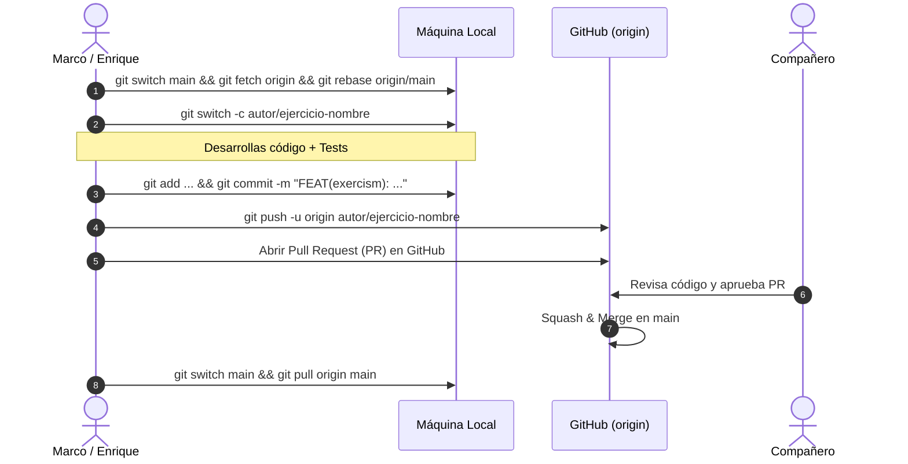

# 🛠️ Manual Profesional de Git: Guía de Trabajo y Colaboración

> **Autores:** Marco Huamani & Enrique Paul  
> **Curso:** Algoritmos y Estructuras de Datos (CC232 - UNI)

Esta guía es la referencia técnica para trabajar de forma profesional en este repositorio, evitar conflictos al hacer `push`, entender la mecánica interna de cada comando y dominar el flujo de trabajo en equipo mediante **Ramas y Pull Requests**.

---

## 🧠 1. El Modelo Mental de Git: Las 4 Zonas

Para no cometer errores en Git, es indispensable entender que cualquier cambio de código transita por 4 estados o zonas bien delimitadas:

```
+-------------------+          +-------------------+          +-------------------+          +-------------------+
| Working Directory | -------> |   Staging Area    | -------> | Local Repository  | -------> | Remote Repository |
| (Tus archivos)    | git add  |      (Index)      | git commit | (.git / HEAD)   | git push | (GitHub / Origin) |
+-------------------+          +-------------------+          +-------------------+          +-------------------+
        ^                               |                              |                              |
        |          git restore          |         git reset            |          git fetch           |
        +-------------------------------+------------------------------+------------------------------+
```

1. **Working Directory (Directorio de Trabajo):** El espacio físico donde programas (`.cpp`, `.h`, `.md`). Los cambios aquí son volátiles y aún no están registrados por Git.
2. **Staging Area / Index (Área de Preparación):** La zona intermedia donde seleccionas quirúrgicamente qué líneas y archivos formarán parte del siguiente snapshot (commit).
3. **Local Repository (Repositorio Local - `.git`):** La base de datos inmutable en tu disco donde residen todos los commits confirmados de tu historial local.
4. **Remote Repository (Repositorio Remoto - GitHub):** El servidor central en la nube donde tú y tu compañero sincronizan sus ramas y debaten mediante Pull Requests.

---

## ⚙️ 2. Configuración Inicial e Identidad

### `git config`

- **¿Por qué existe?** Git firma cada commit con un nombre y correo electrónico. Sin esto, tus contribuciones saldrán anónimas o desvinculadas de tu perfil de GitHub.
- **Sintaxis:**

  ```powershell
  # Configuración global de identidad
  git config --global user.name "Tu Nombre"
  git config --global user.email "tu_correo@ejemplo.com"

  # Configurar 'main' como rama por defecto
  git config --global init.defaultBranch main

  # Inspeccionar toda la configuración activa
  git config --list --show-origin
  ```

---

## 🚀 3. Inicio y Clonación de Repositorios

### `git clone`

- **¿Por qué existe?** Descarga una réplica completa del repositorio remoto con todo su árbol de ramas e historial de commits, vinculando automáticamente el remoto `origin`.
- **Sintaxis:**
  ```powershell
  git clone https://github.com/Marco-H-B/algorithms-and-data-structures.git
  ```

---

## 🔍 4. Diagnóstico e Inspección Quirúrgica

### `git status`

- **¿Por qué existe?** Brinda una vista panorámica del estado de las zonas: en qué rama estás, qué modificaste y qué tienes en staging.
- **Sintaxis:**
  ```powershell
  # Formato compacto senior (flags ?? no rastreado, M modificado, A agregado)
  git status -s
  ```
- **Caso de uso:** Ejecutas `git status -s` antes de commitear para verificar que no estás metiendo binarios compilados `.exe` o archivos temporales.

### `git diff`

- **¿Por qué existe?** Permite revisar diferencias exactas línea por línea antes de confirmar cambios.
- **Sintaxis:**

  ```powershell
  # Diferencia entre Working Directory y Staging (lo que editaste)
  git diff

  # Diferencia entre Staging y el último Commit (lo que vas a commitear)
  git diff --staged
  ```

- **Caso de uso:** Estás resolviendo un árbol AVL y quieres revisar qué líneas modificaste en la rotación doble antes de hacer `git add`.

### `git log`

- **¿Por qué existe?** Navega y audita el historial cronológico de commits.
- **Sintaxis:**

  ```powershell
  # Vista compacta de 1 línea por commit
  git log --oneline

  # Árbol visual con bifurcación de ramas y etiquetas
  git log --oneline --graph --all --decorate -n 15
  ```

---

## 📦 5. Preparación (Staging) y Commits Atómicos

### `git add`

- **¿Por qué existe?** Pasa cambios al _Staging Area_. Permite aplicar **Micro-Staging** para armar commits temáticos e independientes.
- **Sintaxis:**

  ```powershell
  # Agregar archivo específico
  git add resolucion_problemas/Exercism/marco/cpp/pacman_rules.cpp

  # Agregar interactivamente por fragmentos (hunks)
  git add -p archivo.cpp
  ```

### `git commit`

- **¿Por qué existe?** Congela el estado del _Staging Area_ en un snapshot permanente en la historia local.
- **Sintaxis:**
  ```powershell
  # Estándar obligatorio Conventional Commits en español
  git commit -m "FEAT(exercism): resolver pacman rules en cpp"
  ```
- **Tipos de commit:**
  - `FEAT`: Nueva funcionalidad o ejercicio resuelto.
  - `FIX`: Corrección de un bug o fallo.
  - `DOCS`: Documentación o cambios en apuntes teóricos.
  - `STYLE`: Formato, espaciado o indentación (sin tocar lógica).
  - `REFACTOR`: Reestructuración de código sin alterar comportamiento.
  - `PERF`: Optimización de complejidad temporal/espacial Big O.
  - `TEST`: Creación o modificación de casos de prueba.

### `git commit --amend`

- **¿Por qué existe?** Reescribe el commit más reciente para cambiar su mensaje o incluir un archivo olvidado sin generar un commit extra innecesario.
- **Sintaxis:**
  ```powershell
  git add archivo_olvidado.cpp
  git commit --amend --no-edit
  ```

---

## 🌿 6. Gestión Moderna de Ramas (Branches)

### `git switch` (Estándar Moderno - Reemplazo de checkout)

- **¿Por qué existe?** Sustituye a `checkout` para la navegación exclusiva de ramas, reduciendo errores humanos.
- **Sintaxis:**

  ```powershell
  # Moverse a una rama existente
  git switch main

  # Crear y moverse a una nueva rama en un solo comando (-c = create)
  git switch -c marco/exercism-pacman
  # o para Enrique:
  git switch -c enrique/exercism-two-sum
  ```

### `git branch`

- **¿Por qué existe?** Lista, renombra o destruye ramas locales.
- **Sintaxis:**

  ```powershell
  # Listar ramas locales (* indica la activa)
  git branch

  # Borrado seguro (avisa si la rama no ha sido fusionada)
  git branch -d marco/exercism-pacman
  ```

---

## 🌐 7. Sincronización Remota Segura (GitHub)

### `git fetch` (Descarga Segura)

- **¿Por qué existe?** Descarga ramas y commits de GitHub a tu base de datos **sin alterar tus archivos de trabajo locales**.
- **Sintaxis:** `git fetch origin`
- **Caso de uso:** Inspeccionar qué commits subió tu compañero a `main` antes de que decidas fusionarlos:
  ```powershell
  git fetch origin
  git log HEAD..origin/main --oneline
  ```

### `git pull`

- **¿Por qué existe?** Atajo que ejecuta `git fetch` + `git merge` automático. Integra los cambios remotos en tu rama actual de inmediato.
- **Sintaxis:** `git pull origin main`

### `git push`

- **¿Por qué existe?** Sube tus ramas y commits locales a GitHub.
- **Sintaxis:**

  ```powershell
  # Primera subida con vinculación upstream (-u):
  git push -u origin marco/exercism-pacman

  # Subidas posteriores en la misma rama:
  git push
  ```

---

## 🔀 8. Integración: Merge vs Rebase

### `git merge` (Historial Real)

- **¿Por qué existe?** Combina dos historias independientes mediante un _commit de fusión_.
- **Sintaxis:**
  ```powershell
  git switch main
  git merge marco/exercism-pacman
  ```

### `git rebase` (Historial Lineal y Limpio)

- **¿Por qué existe?** Toma tus commits locales y los traslada para que se apliquen **encima** de la última versión de `main`.
- **Sintaxis:**
  ```powershell
  # Estando en tu rama personal:
  git fetch origin
  git rebase origin/main
  ```
- **Regla de Oro:** **NUNCA hagas rebase sobre `main` ni sobre ramas compartidas.** Úsalo solo en tus ramas privadas de trabajo.

---

## 🛟 9. Red de Seguridad y Deshacer Cambios (Safety Net)

### `git restore` (Estándar Moderno)

- **¿Por qué existe?** Descarta modificaciones de archivos o los saca de staging sin tocar ramas ni historial.
- **Sintaxis:**

  ```powershell
  # Descartar cambios en Working Directory (vuelve al último commit)
  git restore archivo.cpp

  # Sacar de Staging Area sin perder lo que escribiste
  git restore --staged archivo.cpp
  ```

### `git reset` (Mover HEAD hacia atrás)

| Opción                  | HEAD      | Staging Area                    | Working Directory               | Nivel de Riesgo |
| :---------------------- | :-------- | :------------------------------ | :------------------------------ | :-------------- |
| **`--soft`**            | Retrocede | **Mantiene** cambios en staging | **Mantiene** tus archivos       | 🟢 Seguro       |
| **`--mixed`** (default) | Retrocede | **Limpia** el staging           | **Mantiene** tus archivos       | 🟡 Medio        |
| **`--hard`**            | Retrocede | **Limpia** el staging           | **Borra todo** destructivamente | 🔴 Peligroso    |

```powershell
# Deshacer commit pero conservar cambios en staging:
git reset --soft HEAD~1
```

### `git revert` (Deshacer en Remoto)

- **¿Por qué existe?** Crea un **nuevo commit que aplica el cambio exactamente inverso** al commit especificado. Es la única forma segura de revertir un cambio que ya está en GitHub.
- **Sintaxis:** `git revert <hash_del_commit>`

---

## 📦 10. Almacén Temporal (Git Stash)

### `git stash`

- **¿Por qué existe?** Guarda temporalmente tus cambios no confirmados en una pila oculta, dejando tu directorio de trabajo limpio para poder cambiarte de rama de inmediato.
- **Sintaxis:**

  ```powershell
  # Guardar cambios con mensaje descriptivo
  git stash push -m "avance a medias de binary search"

  # Recuperar y borrar el stash más reciente
  git stash pop
  ```

---

## 🕵️ 11. Rescate con `git reflog` (La Máquina del Tiempo)

- **¿Por qué existe?** Registra cada movimiento de `HEAD` en tu máquina local. Permite rescatar commits "perdidos" tras un `reset --hard` o una rama eliminada por error.
- **Sintaxis:**

  ```powershell
  # 1. Ver el historial de saltos de HEAD
  git reflog

  # 2. Rescatar el hash deseado
  git reset --hard HEAD@{1}
  ```

---

## 🤝 12. Protocolo de Trabajo en Pareja: Marco & Enrique

Para que ambos colaboren sin pisarse los commits jamás:



### Reglas de Oro

1. **Ramas Aisladas:** Marco usa ramas `marco/<tema>` y Enrique usa ramas `enrique/<tema>`.
2. **`main` es Sagrada:** Nadie hace push directo a `main`. Todo entra por Pull Request en GitHub.
3. **Carpetas Independientes:** Cada uno trabaja exclusivamente en su subcarpeta (`resolucion_problemas/.../marco/` vs `/enrique/`).
4. **Commits Convencionales:** Usar siempre `FEAT`, `FIX`, `DOCS`, `REFACTOR`, `PERF`, `TEST` en mayúsculas y descripción concisa en español.

---

### Cheatsheet Rápido Diario

| Acción                               | Comando                                                            |
| :----------------------------------- | :----------------------------------------------------------------- |
| **1. Sincronizar al empezar el día** | `git switch main && git fetch origin && git rebase origin/main`    |
| **2. Crear mi rama de trabajo**      | `git switch -c marco/<nombre-reto>` _(o `enrique/...`)_            |
| **3. Revisar estado y diferencias**  | `git status -s` o `git diff`                                       |
| **4. Agregar archivos puntuales**    | `git add <ruta-del-archivo>`                                       |
| **5. Commit atómico**                | `git commit -m "FEAT(exercism): <descripción>"`                    |
| **6. Subir mi rama para abrir PR**   | `git push -u origin marco/<nombre-reto>`                           |
| **7. Limpiar rama local tras merge** | `git switch main && git pull && git branch -d marco/<nombre-reto>` |
